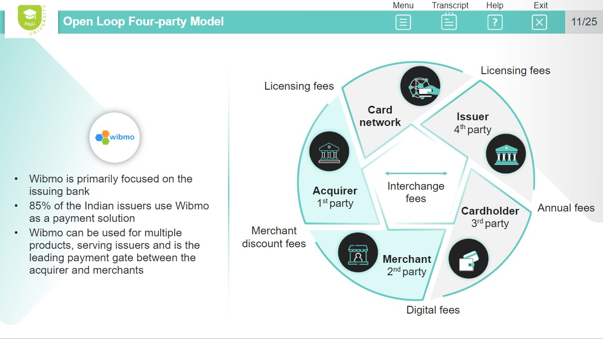
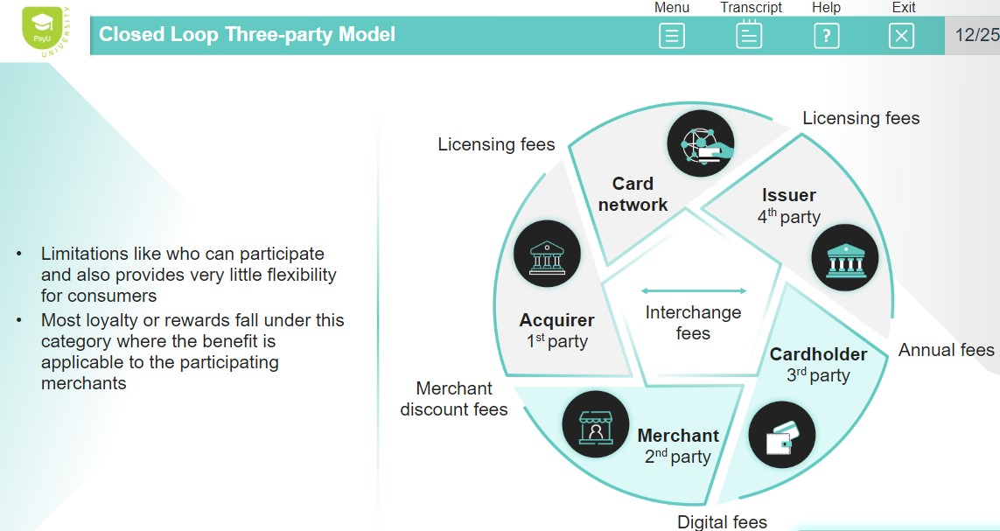
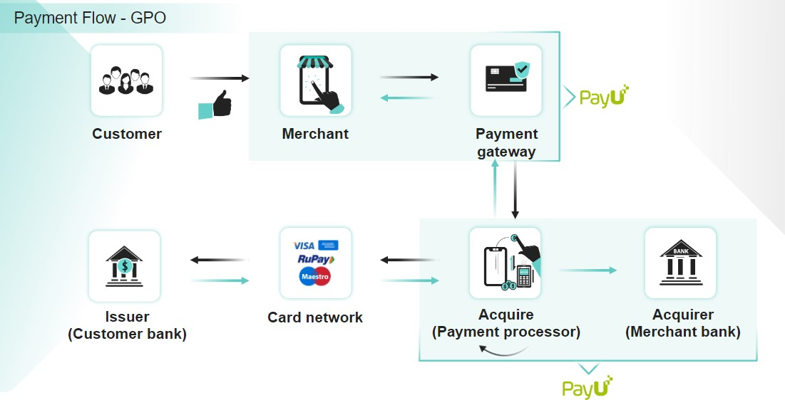
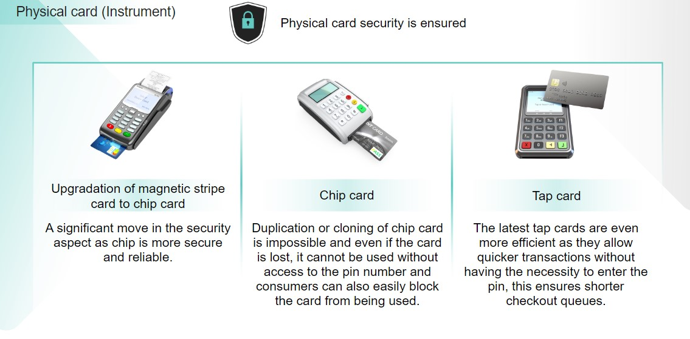
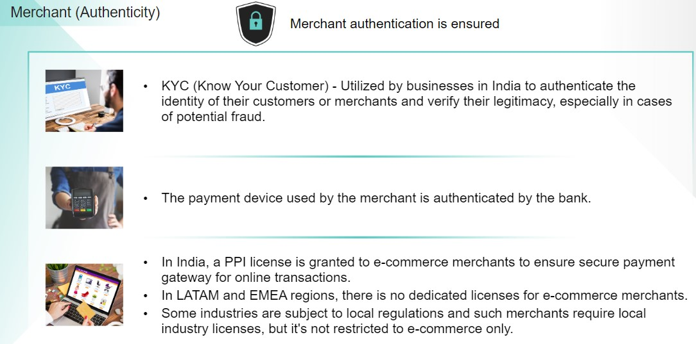
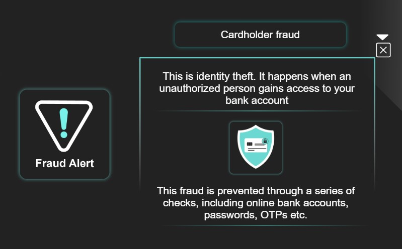
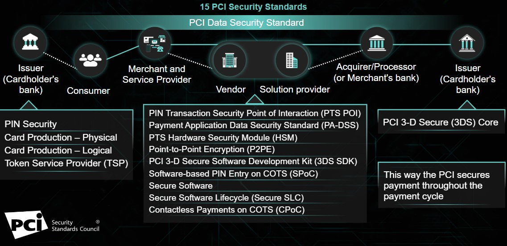

# Payment 101

## PayU Overview

### 1. Prosus
- Global investment group 
- Builds leading consumer internet compaines that empower people and enrich communities
- Primary listing on Euronext Amsterdam(AEX:PRX)
- Secondary listing on JSE Limited(XJSE:PRX)
- Invested in OLX Group, Delivery Hero, PayU, EMAG, Flipkart
- Majority owned by South African multinational group NASPERS 
- Hierarchy -> NASPERS ---> PROSUS ---> PAYU --> FINTECH

### 2. PayU(Founded in 2002)
- The Fintech and e-payments division of Prosus is PayU, which is majority owned by the equity group Naspers, a South African multinational
- Prominent digit payment solutions provider which provides holistic needs beyond payments
- First transactions launched in Poland
- 50+ high growth markets
- Focus areas
    1. India Payments: Being a leader in institutional plan by building excellence in tech, product and operations.
    2. Digital Banking: Building a digital bank and scaling credit for the FinTech Indian mass market.
    3. FinTech Ecosystem: Offering complete financial services stack for consumers and SMEs
    4. GPO Payments: Strengthening the core markets; entering into BNPL in LATAM and EMEA

### 3. Payu Vision
- Create a world without financial borders where everyone can prosper.
- PayU provides businesses and consumers in emerging markets with the financial services and products they need to thrive
- PayU's payment solutions are designed to meet the needs of globally-minded merchants as well as small and medium Enterprises(SMEs) and entrepreneurs.
- PayU's expertise in 50+ emerging markets enables it to offer a wide range of payment and consumer credit solutions aimed at increasing financial access throughout the world.
- In addition to pursuing PayU's vision through a variety of innovative offerings in the payments and credit space, PayU is also one of the world's most active FinTech investors, with over USD $1 Billion in investments to date.

### 4. PayU Verticals
1. Payments
    - Global presence with local expertise in all regions of business operations
    - Includes PayU and Wibmo which is another entity owned by Prosus and was bought in 2019
2. Credit
    - Credit vertical is an integral part of PayU
    - LazyPay and PaySense have provided opportunities to expand
3. Investments
    - Investments is a separate vertical managed centrally by Prosus
    - Champions in FinTech space.

## Payment Overview

### 1. Payment History(LATAM & India)
- Barter system (Before 500 BC)
- First coins (700-500 BC)
- Cheques (800 BC)
- Bankers (15th Century)
- Charge cards (1940s)
- Payment cards (1960s)
- Mobile & M-Payments (Late 1990s)
- Cryptocurrencies (2018)

### 2. Payment Methods
500+ prominent methods of payments
- UPI:(Online/Offline) To transact seamlessely via mobile phone(GooglePay, PhonePe, PayTm)
- Payment cards:(Online/Offline) To pay for goods/services without paying in cash or writing a cheque(RuPay, Visa, MasterCard)
- NetBanking:(Online) To transfer funds, pay institutions, pay taxes, etc. (NEFT, RTGS, IMPS)
- BNPL:(Online) To get instant credit with payback cycles typically ranging from 15 to 30 days(LazyPay, ZEST)
- Wallets:(Online/Offline) To pay utility bills, DTH & Mobile bills, etc(Mobikwik,airtel,freecharge)

### 3. Different types of Payment methods
1. India
| Payment Methods | Regulated by | Speed of Settlement | Minimum Transfer | Maximum transfer | Payment Options | Charges |
| --------------- | ------------ | ------------------- | ---------------- | ---------------- | --------------- | -------- |
| NEFT(National Electronic Fund Transfer) | Regulated by RBI | Half-hourly batches |  Rs 1 | No limit | Online, Offline | No charges |
| RTGS(Real Time Gross Settlement) | Regulated by RBI | Immediate Settlement | Rs. 2 Lakh | No Limit | Online, Offline | Differs based on bank and amount |
| IMPS(Immediate Payment Service) | Regulated by NPCI(National Payments Corporation of India) | Immediate Settlement | Rs. 5 | Rs. 2 Lakh | Online | Differs based on bank and amount |
| UPI(Unified Payments Interface) | Regulated by NPCI | Immediate Settlement | Rs. 1 | Rs. 1 Lakh | Online | No charges |
| Payment cards(Issued by respective bank) | Conjunction with local banks | Batch settlement 5 times a day | Rs. 1 | Depends on card | Online, Offline | Varies by merchant |
| BNPL (Buy now pay later) | Regulated by private entities adhering to RBI norms | Offline merchant settlement | No minimum transfer | Depends on Customer | Online | Varies by merchant |

2. EMEA
| Payment Methods | Convenience/Checkout UX differences | Coverage | Cost Difference | Settlement speed | Chargeback risk difference |
| --------------- | ----------------------------------- | -------- | --------------- | ---------------- |
| Payment cards and card-based wallets | High | Global | High | 1-3 days | Yes |
| Instant bank transfers | Medium | Local | Low | 1 day | No | 
| Mobile Payments or digital money wallets | High | Local or Global | Medium to High | 1-3 days | No |
| Local card schemes | High | Local | Medium | 1-3 days | Yes |
| Cash APMs | Low | Local | Low | 1-30 days | No |
| Credit(Instalments/BNPL) | Medium | Local | High | 1-2 days | No |

### 4. Alternative Payment methods
**India**
1. eWallets: Main players (PayPal,PhonePe, GooglePay, ApplePay, Yandex, Alipay)
2. Bank transfer
3. BNPL/Invoice payments

### 5. Deciding factors for Payment Methods
1. Speed of settlement
2. Cashback, points, rewards and loyalty
3. Amount and time
4. Access to bank account
5. Charges incurred
6. Business case

How to choose between payment cards and other Alternative Payment methods?
1. Country of customers
2. Type of customers(B2C/B2B)
3. Average transaction value
4. Domestic/cross-border
5. Industry
6. Sales channels(Web, Mobile phone, social media, chat)
7. Costs
8. Risk appetite

### 6. Payment Ecosystem
1. Customer: One who initiates payment transactions through any channel Eg: Retail or corporate
2. Payment Channel: Channel from where payment transaction has been initiated Eg: ATM, POS, e-Commerce, UPI, etc
3. Acquirer: Bank/Financial Institution to whom the channel is affiliated. Bank/Financial Institution settles fund with the merchants
4. Merchant: One who receives the payment in lieu of the goods sold.
5. Scheme: Card network which facilitates any transaction Eg: Visa, Mastercard, Rupay, Amex, JCB, Diners, etc.
6. Issuer: Bank that issues the card to the customer. Bank settles fund with the customer.
   

### 7. Open Loop Four-party model

PayU plays an important role between the acquirer and merchant

### 8. Closed Loop Three-party model

- Merchants cannot freely accept AMEX and Diners Club through their acquirers
- Merchants need to have an exclusive tie up with Amex and Diners Club

### 9. Payment Card Architecture

### 10. PayU Ecosystem in India
Payu
    - Driving merchant scale and experience through payment acceptance, PayU's additional emerging payment options like credit/BNPL compliments the merchant scale extending into banking.
    - Issuing payment authentication and acquiring payment gateway for maximum value to merchant end-to-end post acceptance till processing.
1. PayU Payments
   - Merchant scale - Enterprise, Small Medium Businesses
   - Acquiring Scale
   - Payment acceptance- Online & Offline
2. PayU Finance
   - Emerging payment method
   - Provides customers to shift from prepaid to postpaid
   - Key enabler for digitl payments
3. Wibmo
   - Issuing scale - Payment authentication
   - Acquiring scale - Payment gateway
   - Bundle new payment methods likes BNPL

### 11. Payment Flow

**Payment Flow for card networks**

 - PayU have a processor and switch which connects to the card network.
 - We pass it to the issuing bank and the bank will authenticate. The solution of authenticate is called ACS - Authentication Control Server.
 - For security we generate OTP

**Payment flow for UPI**

**PayU's Presence across the Payment Flow**

### 12. Merchants Processing at PayU
Steps involved in Merchant Onboarding and underwriting
1. Merchant Meeting: Requirement are discussed.
2. MAF(Merchant Application Form): Submitted by the merchant which is used to receive their personal data.
3. KYC: Identify and verify the merchant's identity
4. Acquirer approval: Due diligence process is carried to check the eligibility of the merchant as risk is with the bank. They will check the tax return files etc.
5. Merchant agreement: Contract governing the relationship between a business and the merchant-acquiring bank it partners with
6. Integration: For merchants containing merchant's account credentials, how to integrate to do business. PayU will give an integration API and DPI.
7. First live transaction: Merchant will get embedded and then the transaction is completed.

### 13. Future Payment Trends
1. Real-time payments: Cross-border & domestic
   - Cross-border payments for merchants enable higher sales via a global customer base, P2P cross border payments in real-time settlement using ISO 20022
   - Cryptos will continue to grow
2. Subscription economy recurring payments(Tokenization)
   - Already on the rise with frictionless online checkout for recurring services at OTT
   - Subscription services like grocery, fitness and education will continue
3. NFT/Cryptocurrency/CBDC(Central Bank Digital Currency)
   - Non-Fungible tokens(NFT) will power the virtual economy on marketplaces like Metaverse enabled via Fiat and Cryptocurrencies
   - Many banking use cases can also be unlocked through NFts eg. Trade finance, asset securitization, etc.
   - With Central Bank Digital Currency(CBDC), NFTs will get a major push towards adoption.
   - Globally NFTs will be $1 Trillion opportunity in the next 1 year itself.
4. IoT/Embedded payments(Tokenization)
   - Invisible payments via embedded payment instruments through IoT will pick up i.e. payment instrument in cars, appliances, etc. will grow.

### 14. Wearable Payment Technology
Wearable payment devices are payment appliances that can be adorned by the person. It can be smart watches/payment rings/bracelets/sunglasses. They provide an alternative way to pay other than a physical card.

### 15. How do merchant websites offer additional discounts to certain bank customers?
BIN is an 8-9 digit number on a payment card that identifies the institution. Various promotional schemes like discounts, cashbacks and other deals will be linked to the BIN of the type of card provided by the associated bank.
- Since the migration to EMV chip cards happened, fraud at POS has significantly reduced as card cloning/skimming is nearly impossible for them.

### 16. What came first, Internet or payment network?
Visa(Sept 1958) by Bank of America as BankAmericard much before Internet started. Internet was launched on 1st Jan, 1983 only.

### Summary
1. PayU plays an important role between the acquirer and merchant.
2. The key deciding factors for selection of various payment methods are cost or charges involved, convenience-access, time of payment, business case - P2P, P2M, instant vs future dated and speed-fund settlement.
3. The four key participants in payment card ecosystem are the issuer, cardholder, merchant and acquirer.
4. The four party model is also called as open loop as the acquirer and issuer side participants can be on different networks or banks but still seamlessly connect and transact.
5. Closed loop payments are three-party model has limitations in who can participate and provides vert little flexibility for consumers.

## Payment Security
- Digital Payment Transactions are increasing day by day because of Cashless payments, Reduced time and Reduced transaction cost.
- Due to this fraudulent activities like Hacking, Security treats, Identity theft, Disputed transactions and Cybercrimes are also increasing.
- Hence Digital payment security is essential to protect the customer data and transaction data with ultimate privacy.
- In order to ensure payment security, Merchants integrate their businesses with payment gateways as a safer and reliable option.
- Payment security is not a choice but is essential as it has the power to make or break your business.
- Weak payment security customers loses confidence leading to business loss
- Establishing trust at every phase of payment lifecycle is important.
- Regularize digital payment methods with common standards to enable secure hassle-free and frictionless transactions.
- The Euro, Mastercard and Visa in early 90's established the 3 Domain security(3DS) for traditional browser-based e-commerce transactions.
  

- Based on the 3 Domain Security, security of physical card, cardholder and merchant are ensured.
- All these 3 domains have to support and accept the end-to-end 3 Domain Security protocols as they cannot operate without adhering to the 3DS standards.

1. Physical card(Instrument)

2. Card holder Security(Identity)

3. Merchant(Authenticity)

### 1. Authentication and Authorization
**Authentication**
- The physical card security and cardholder security establishes authentication as it verifies the card details(name, card number,CVV, etc). 
- The Features or knowledge of the cardholder allows access and usage of the card using biometrics, PIN, OTP or other behavioural patterns.

**Authorization**
- If the transaction passes through the merchant security and 3DS, it establishes authorization to the bank to verify what the user has access to (card, balance, card validity, card blocked status, etc).
- If the bank provides the authorization, the payment transaction is completed.

**3DS 2.0**
Protocols and core function specifications to support online and digital payments including: 
    1. App-based authentications
    2. Integrations with digital wallets since Oct 22, 2022
    3. This update takes the new payment channels into account and supports the delivery of industry-leading security, performance and user experience.

### 2. Fraud and Risk Management(FRM)
- Threats such as identity theft, spyware, phishing and data scams continue to occur in digital payment world.
- Hence FRM is used to issue and build trust and acceptance for customers.
  
1. Merchant fraud

2. Card Holder Fraud

3. Card Fraud

### 3. User Security
- User security practices in the digital payments world is ensured by the 2 Factor Authentication(2FA) security system.
- 2FA is the global standard practiced around the world in places like European Economic Area(EEA), UK, LATAM and Asia, except the US.
- EEA and India are currently the largest 2 Factor Authentication regions.
- If any merchant or bank or business fails to follow this 2FA process, a liability issue will be raised and escalated.

**2 Factor Authentication**
2 Factor Authentication demands details which will be a combination of any two of
1. Something you know
   - PIN number 
   - Password
   - Date of Birth
   - OTP
2. Something you have
   - The devices that demand your authentication to access your payment card such as smartphone or mobile application, etc.
3. Something you are
   - Something you are indicates your permission using your biometrics such as faceID, thumbprint, retina scan etc.

### 4. Acquirer Security
Everyday the amount of customer data that merchants and banks come across is humongous and a weak cybersecurity could bring about serious implications in customer data security.

To ensure acquirer security following four key aspects are followed
1. Business Intelligence(Uses analytical s/w to ensure security)
   - Conducting predictive, adaptive and statistical analysis(inclusive of technology that tracks the regular device, its location, foriegn device usage etc)
   - Reducing manual reviews through fast iterating ML models
   - Reporting false positives
   - Self-learning to redefine algorithms
2. Behavior tracking(Involves data analysis)
   - Identify key transactional behaviors and spending patterns
   - Recognize uncharacteristic transactions
   - Track device fingerprinting
   - Track behavioral biometrics including password patterns, typing speed etc.
3. Enterprise screening(Carried out to identify fraud patterns)
   - Validating multiple merchant touch points
   - Correlating several use cases in search for potential relationships, link analysisand linkage to the customers(in terms of addresses, devices, time etc)
4. Case management(Identifies the potential suspect transactions)
   - High level investigations
   - Simple and effective user interface
   - Automated case management using IVR systems
   - RBA via biometric or mobile authentication
   - Detailed dashboard and MIS reports
   - On hold transactions- may be flagged for fraud.
   - These transactions close only after the fraud analysis takes place and is cleared of any suspicions.

### 5. Compilance and Regulations
1. PCI DSS
   - Payment Card Industry Data Security Standard
   - This is a global compilance entity that accepts and handles payment card data or Personal Identifiable information(PII) data
   - It focuses on improving the payment account security throughout the transaction process
   - It is applicable to any organization regardless of its size or number of transactions.
   - Globally, it is mandatory for all the companies to adhere to the PCI DSS standards and compliance guidelines
2. PCI SSF
   - Payment Card Industry Software Security Framework
   - This is a collection of standards and programs for a secure design and development of payment software.
   - It protects the integrity of the software and the confidentiality of sensitive data which it captures, stores, processes and transmits
   - Globally, it is applicable to vendors that produces or sell payment applications.
3. GDPR
   - General Data Protection Regulation
   - It is a regulation in European Union on data protection and privacy.
   - It aims to simplify the regulatory environment for businesses so that both citizens and businesses in EU can fully benefit from the digital economy.
4. ISMS
   - Information Security Management System
   - ISMS is a holistic approach to securing the Confidentiality, Integrity and Availability(CIA) of corporate information assets
5. ISO 27001
   - Consists of policies, procedures and other controls involving people, processes and technology
   - It is a global standard with a set of 14 controls that defines information security guidelines across assets, people, infrastructure, cryptography standards, vendors, incident management and others.
6. ISO 27701
   - Privacy Information Management System that provides guidance on the protection of privacy including how organization should manage personal information, and assists in demonstrating compliance with privacy regulations around the world
   - This is applicable globally to all types and sizes of organizations, including public and private companies, government entities and non-profit organizations.
7. PSD2
   - Payment Services Directive, which is a European regulation for electronic payment services.
   - It seeks to make payments more secure in Europe, boost innovations and help banking services adapt to new Technologies.
8. Data Localization
   - Data localization is specific to india for storing payment data in india only by the entities handling payment data.
   - They require companies to store a copy of the data locally and process data locally.
   - Mandate individual or government consent for data transfers
9. RBI PA-PG
    - Reserve Bank of India guidelines for Payment Aggregators and Payment Gateways
    - It mandates that no entity other than issuers can store the payment card data even if they are PCI DSS compliant.
    - According to RBI PA-PG, the only way to store the payment card data is through Tokenization either in the card network or by issuer tokens

### 6. PCI DSS
- PCI DSS Compliant is the most basic and stringent requirement for any payments entity to do business
PayU has the highest level of PCI compliance(Level 1), and because we maintain compliance our merchants will not have to do it.

### Summary
1. Payments are universally regulated with common standards and features to enable frictionless transactions in a hassle-free manner
2. 3DS systems defines international protocols that are to be followed across the 3 main domains in the payment lifecycle which are, the merchant bank, network and the customer bank
3. Payment transaction is often performed in 2 stages
   - Authentication(That relies on 3DS framework = acquirer, issuer and payment network)
   - Authorization
4. Merchant fraud could mean compromising on a whole lot of sensitive customer data that is supposed to be maintained secure, to prevent this fraud merchant KYC check and AML sanctions are conducted.
5. CardHolder fraud is identity theft, It happens when an authorized person gains access to your bank account.
6. Cardholder fraud is a sophisticated theft. It happens when an unauthorized person gains access to your bank account. This fraud is prevented through a series of checks, including online bank accounts, passwords, OTPs, etc
7. Card fraud is a sophisticated theft called valid fraud. It involves logival duplication of personal card details such that there is no place doubt. To overcome this threa advanced AI & ML technologies are used.
8. 2FA demands details which will be a combination of something you know, something you have or something you are.
9. Payment Card Industry Data Security Standard(PCI DSS) is a global compliance entity that accepts and handles payment card data or PII data, it is applicable to any organization or company, regardless of size or number of transactions.